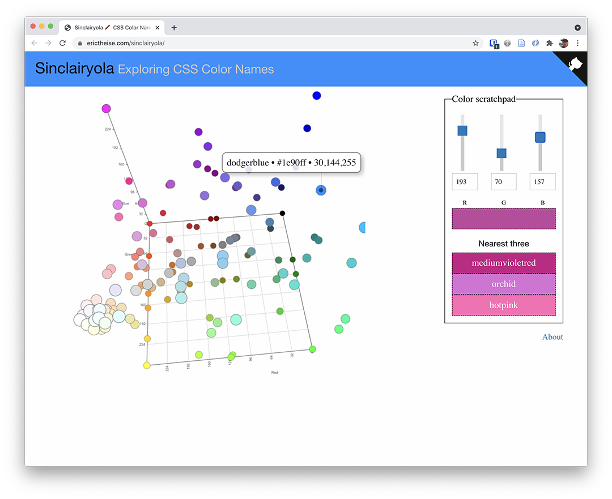

## Sinclairyola

Sinclairyola is a hosted scratchpad for visualizing CSS named colors. It displays the distribution of colors in a 3d RGB cube and it identifies nearest named colors to any arbitrary RGB color.

The best and easiest way to use it is to point your desktop or laptop browser to [this `GitHub pages-hosted site`](https://erictheise.com/sinclairyola/). While the color cube will rotate on a mobile device it won't zoom or display pertinent color information via tooltips.

Although the name derives from combining [Sinclair and Crayola](https://arstechnica.com/information-technology/2015/10/tomato-versus-ff6347-the-tragicomic-history-of-css-color-names/), it's pronounced the same way as __Moviola__, a brand of film editing equipment.
